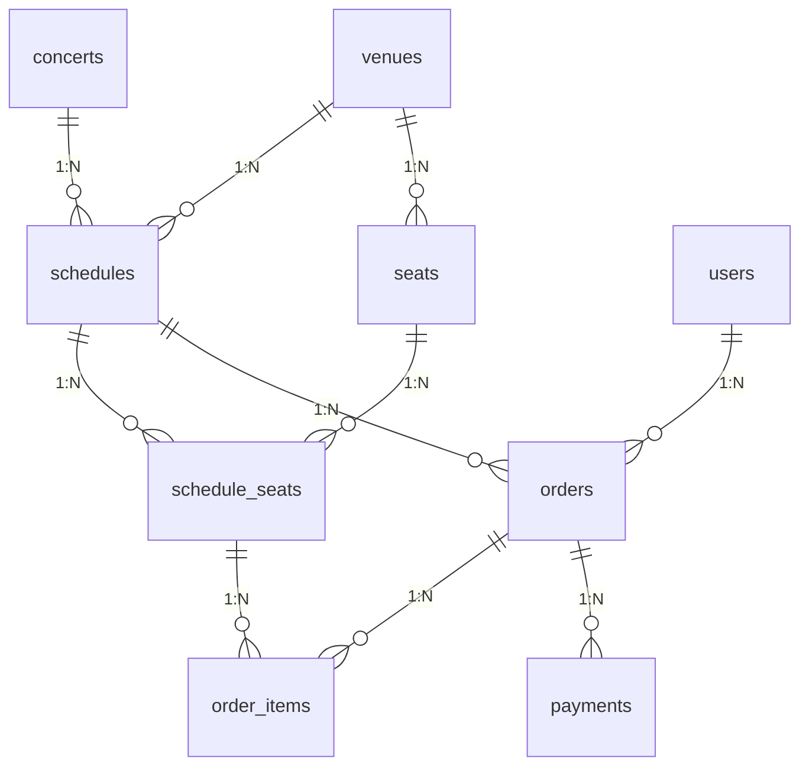
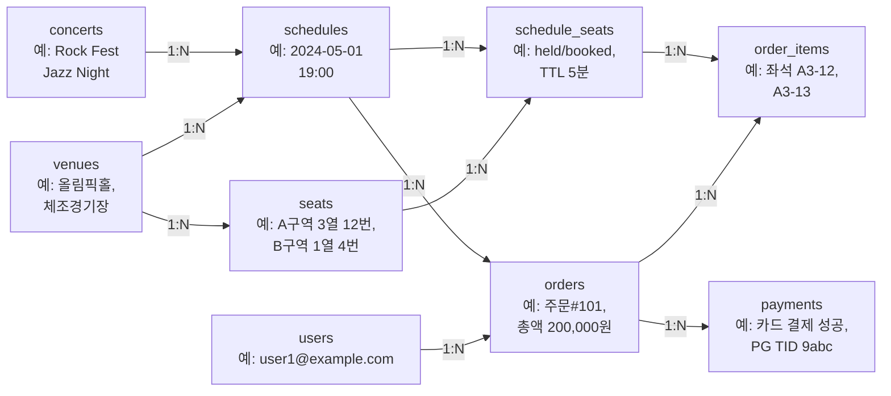

# 콘서트 예매 시스템 DB 설계 가이드

FastAPI + PostgreSQL 기반 예매 도메인을 모델링한 테이블 초안과 핵심 용어 설명입니다. 입문자가 DB 개념을 익히며 확장할 수 있도록 작성했습니다.

## 용어 및 개념 정리 (기초)
- 컬럼(Column): 테이블의 열. 한 속성(예: 가격, 좌석 번호)을 정의하며 데이터 타입과 제약조건을 가진다.
- 레코드(Row, Tuple): 테이블의 한 행. 컬럼 값들의 모음으로 실제 데이터를 담는다.
- 시각 예시:
  ```
  컬럼들 → | seat_id | section | row_label | number |
  레코드 1 |    10   |   A     |     3     |   12   |
  레코드 2 |    11   |   A     |     3     |   13   |
  ```
- 컬럼 헤더가 세로로, 레코드는 가로로 한 줄씩 데이터가 채워진다고 이해하면 된다.
- 스키마(Schema): 테이블, 뷰, 함수 등 DB 객체의 논리적 묶음. PostgreSQL 기본은 `public`.
- 기본키(PK): 행을 유일하게 식별하는 컬럼. `SERIAL` 대신 `BIGINT GENERATED BY DEFAULT AS IDENTITY` 권장.
- 외래키(FK): 다른 테이블의 PK를 참조하는 컬럼. 무결성(참조 무결성)이란 “참조가 항상 존재해야 한다”는 규칙을 지켜 잘못된 고아 데이터가 없도록 보장하는 것. 삭제/업데이트 시 `ON DELETE/UPDATE` 전략으로 후속 동작을 정의한다(예: `CASCADE`는 함께 삭제/갱신, `RESTRICT`는 막기, `SET NULL`은 참조를 NULL로 비우기).
- 인덱스(Index): 검색 속도 향상 자료구조. 좌석 상태 조회용 `(schedule_id, status)` 같은 복합 인덱스가 유용.
- 정규화/비정규화: 중복 최소화 vs 조회 최적화 트레이드오프. 좌석 상태처럼 자주 갱신되는 엔터티는 정규화 후 필요 시 캐시.
- 트랜잭션(Transaction): 작업 단위를 원자적으로 실행. 좌석 홀드+주문 생성 시 하나로 묶어 실패 시 롤백.
- 고립화 수준(Isolation level): 동시성 제어 강도. 기본 `READ COMMITTED` + 필요한 쿼리에서 `FOR UPDATE`로 보완.
- 낙관적 락(Optimistic Lock): 버전 컬럼 증가로 충돌 감지. 재시도 로직 필요.
- 비관적 락(Pessimistic Lock): DB가 잠금을 선점(`FOR UPDATE`). 충돌 감소하지만 대기·데드락 가능.
- 시퀀스/아이덴티티: PK 자동 증가. 표준인 `IDENTITY` 사용 권장.
- 제약조건(Constraints): `NOT NULL`, `UNIQUE`, `CHECK`, `DEFAULT` 등 데이터 무결성 규칙.

## 테이블 관계(ERD)


### 테이블 관계(예시 값이 보이는 뷰)


## 핵심 테이블 초안

### concerts (공연)
| 컬럼 | 타입 | 설명/목적 |
| --- | --- | --- |
| id (PK) | BIGINT IDENTITY | 공연 식별자 |
| title | TEXT | 공연 제목 |
| artist | TEXT | 아티스트/팀 이름 |
| genre | TEXT | 장르 태그 |
| description | TEXT | 소개/설명 |
| runtime_minutes | INT | 러닝타임(분) |
| is_active | BOOLEAN | 판매 가능 여부(논리 삭제 대용) |
| created_at | TIMESTAMPTZ | 생성 시각 |

- 공연 메타데이터를 관리. 과거 공연은 `is_active=false`로 비활성화.

### venues (공연장)
| 컬럼 | 타입 | 설명/목적 |
| --- | --- | --- |
| id (PK) | BIGINT IDENTITY | 공연장 식별자 |
| name | TEXT | 공연장 이름 |
| address | TEXT | 주소 |
| seat_map_version | INT | 좌석 배치 버전 관리 |
| created_at | TIMESTAMPTZ | 생성 시각 |

- 좌석 구조가 바뀔 수 있으니 버전을 두어 좌석 배치 이력 관리.

### schedules (회차)
| 컬럼 | 타입 | 설명/목적 |
| --- | --- | --- |
| id (PK) | BIGINT IDENTITY | 회차 식별자 |
| concert_id (FK) | BIGINT | 공연 참조 |
| venue_id (FK) | BIGINT | 공연장 참조 |
| start_at | TIMESTAMPTZ | 시작 시각 |
| end_at | TIMESTAMPTZ | 종료 시각 |
| status | TEXT | 판매 상태(sales_open/closed/cancelled) |
| created_at | TIMESTAMPTZ | 생성 시각 |

- 한 공연이 여러 회차를 가질 수 있으므로 공연/회차 분리.

### seats (좌석 정의)
| 컬럼 | 타입 | 설명/목적 |
| --- | --- | --- |
| id (PK) | BIGINT IDENTITY | 좌석 식별자 |
| venue_id (FK) | BIGINT | 공연장 참조 |
| section | TEXT | 층/블록 |
| row_label | TEXT | 행 라벨 |
| number | INT | 좌석 번호 |
| seat_type | TEXT | 좌석 등급(vip/r/std 등) |
| base_price | NUMERIC(12,2) | 기본가(회차별 가격 조정의 기준) |

- 공연장 기준 좌석 마스터. 회차별 상태는 분리.

### schedule_seats (회차별 좌석 상태)
| 컬럼 | 타입 | 설명/목적 |
| --- | --- | --- |
| id (PK) | BIGINT IDENTITY | 회차-좌석 상태 식별자 |
| schedule_id (FK) | BIGINT | 회차 참조 |
| seat_id (FK) | BIGINT | 좌석 참조 |
| status | TEXT | available/held/pending_payment/booked/cancelled |
| hold_expires_at | TIMESTAMPTZ | 홀드 만료 시각(TTL) |
| price | NUMERIC(12,2) | 실제 판매가(프로모션 반영) |
| version | INT | 낙관적 락용 버전 |

- 좌석 상태를 회차 단위로 관리해 한 공연장의 좌석을 여러 회차에서 재사용.
- 동시성: 결제 중 중복 예약 방지를 위해 `FOR UPDATE` 또는 `version` 기반 낙관적 락 사용.

### orders (예매 주문)
| 컬럼 | 타입 | 설명/목적 |
| --- | --- | --- |
| id (PK) | BIGINT IDENTITY | 주문 식별자 |
| user_id | BIGINT | 회원 참조(비회원이면 NULL) |
| schedule_id (FK) | BIGINT | 회차 참조 |
| total_amount | NUMERIC(12,2) | 총액 |
| status | TEXT | created/awaiting_payment/paid/cancelled/refunded |
| created_at | TIMESTAMPTZ | 생성 시각 |
| updated_at | TIMESTAMPTZ | 갱신 시각 |

- 주문 단위로 결제/취소 흐름을 추적.

### order_items (주문 좌석 상세)
| 컬럼 | 타입 | 설명/목적 |
| --- | --- | --- |
| id (PK) | BIGINT IDENTITY | 주문 아이템 식별자 |
| order_id (FK) | BIGINT | 주문 참조 |
| schedule_seat_id (FK) | BIGINT | 회차별 좌석 참조 |
| price | NUMERIC(12,2) | 좌석별 금액 |
| status | TEXT | held/booked/cancelled 등 좌석 상태 미러링 |
| created_at | TIMESTAMPTZ | 생성 시각 |

- 좌석별 상태를 주문과 분리해 부분 취소 등 세밀한 조정 가능.

### payments (결제 트랜잭션 로그)
| 컬럼 | 타입 | 설명/목적 |
| --- | --- | --- |
| id (PK) | BIGINT IDENTITY | 결제 로그 식별자 |
| order_id (FK) | BIGINT | 주문 참조 |
| provider | TEXT | 결제 수단/PG 구분(card/kakao/naver 등) |
| amount | NUMERIC(12,2) | 결제 금액 |
| status | TEXT | initiated/success/fail/refund |
| pg_tid | TEXT | PG 트랜잭션 아이디 |
| approved_at | TIMESTAMPTZ | 승인 시각 |
| created_at | TIMESTAMPTZ | 생성 시각 |

- 외부 PG 연동 결과를 보존하여 정산/분쟁 대응.

### users (선택)
| 컬럼 | 타입 | 설명/목적 |
| --- | --- | --- |
| id (PK) | BIGINT IDENTITY | 사용자 식별자 |
| email | TEXT | 이메일 |
| name | TEXT | 이름 |
| phone | TEXT | 연락처 |
| created_at | TIMESTAMPTZ | 생성 시각 |

- 필요 시 최소한의 회원 정보를 저장. 비회원 플로우면 nullable 참조 허용.

## 예시 DDL (PostgreSQL)
```sql
CREATE TABLE concerts (
  id BIGINT GENERATED BY DEFAULT AS IDENTITY PRIMARY KEY,
  title TEXT NOT NULL,
  artist TEXT NOT NULL,
  genre TEXT,
  description TEXT,
  runtime_minutes INT,
  is_active BOOLEAN DEFAULT TRUE,
  created_at TIMESTAMPTZ DEFAULT now()
);

CREATE TABLE venues (
  id BIGINT GENERATED BY DEFAULT AS IDENTITY PRIMARY KEY,
  name TEXT NOT NULL,
  address TEXT,
  seat_map_version INT DEFAULT 1,
  created_at TIMESTAMPTZ DEFAULT now()
);

CREATE TABLE schedules (
  id BIGINT GENERATED BY DEFAULT AS IDENTITY PRIMARY KEY,
  concert_id BIGINT REFERENCES concerts(id),
  venue_id BIGINT REFERENCES venues(id),
  start_at TIMESTAMPTZ NOT NULL,
  end_at TIMESTAMPTZ NOT NULL,
  status TEXT DEFAULT 'sales_open',
  created_at TIMESTAMPTZ DEFAULT now()
);

CREATE TABLE seats (
  id BIGINT GENERATED BY DEFAULT AS IDENTITY PRIMARY KEY,
  venue_id BIGINT REFERENCES venues(id),
  section TEXT,
  row_label TEXT,
  number INT,
  seat_type TEXT,
  base_price NUMERIC(12,2) NOT NULL
);

CREATE TABLE schedule_seats (
  id BIGINT GENERATED BY DEFAULT AS IDENTITY PRIMARY KEY,
  schedule_id BIGINT REFERENCES schedules(id),
  seat_id BIGINT REFERENCES seats(id),
  status TEXT DEFAULT 'available',
  hold_expires_at TIMESTAMPTZ,
  price NUMERIC(12,2) NOT NULL,
  version INT DEFAULT 1
);

CREATE UNIQUE INDEX idx_schedule_seats_unique ON schedule_seats(schedule_id, seat_id);
CREATE INDEX idx_schedule_seats_status ON schedule_seats(schedule_id, status);

CREATE TABLE orders (
  id BIGINT GENERATED BY DEFAULT AS IDENTITY PRIMARY KEY,
  user_id BIGINT,
  schedule_id BIGINT REFERENCES schedules(id),
  total_amount NUMERIC(12,2) NOT NULL,
  status TEXT DEFAULT 'created',
  created_at TIMESTAMPTZ DEFAULT now(),
  updated_at TIMESTAMPTZ DEFAULT now()
);

CREATE TABLE order_items (
  id BIGINT GENERATED BY DEFAULT AS IDENTITY PRIMARY KEY,
  order_id BIGINT REFERENCES orders(id),
  schedule_seat_id BIGINT REFERENCES schedule_seats(id),
  price NUMERIC(12,2) NOT NULL,
  status TEXT DEFAULT 'held',
  created_at TIMESTAMPTZ DEFAULT now()
);

CREATE TABLE payments (
  id BIGINT GENERATED BY DEFAULT AS IDENTITY PRIMARY KEY,
  order_id BIGINT REFERENCES orders(id),
  provider TEXT,
  amount NUMERIC(12,2) NOT NULL,
  status TEXT DEFAULT 'initiated',
  pg_tid TEXT,
  approved_at TIMESTAMPTZ,
  created_at TIMESTAMPTZ DEFAULT now()
);
```

## 좌석 동시성 제어 예시 (트랜잭션)
```sql
BEGIN;
SELECT id, status FROM schedule_seats
 WHERE id = $seat_id AND schedule_id = $schedule_id
 FOR UPDATE;

-- 상태 확인 후 available/held이면 held 로 변경
UPDATE schedule_seats
   SET status = 'held',
       hold_expires_at = now() + interval '5 minutes',
       version = version + 1
 WHERE id = $seat_id;

COMMIT;
```

## 학습 과제 아이디어
- 요구사항 목록화 → ERD 그리기 → 테이블 DDL 작성 후 Alembic 마이그레이션 작성.
- 단위 테스트: 좌석 홀드 타임아웃, 중복 예약 방지, 결제 실패 시 롤백 검증.
- 쿼리 실습: 판매 가능 좌석 조회, 특정 회차 매출 합계, 장르/아티스트별 판매 통계.
- 운영 실습: `EXPLAIN ANALYZE`로 인덱스 효과 확인, 백업/복원(pg_dump/pg_restore) 연습.
